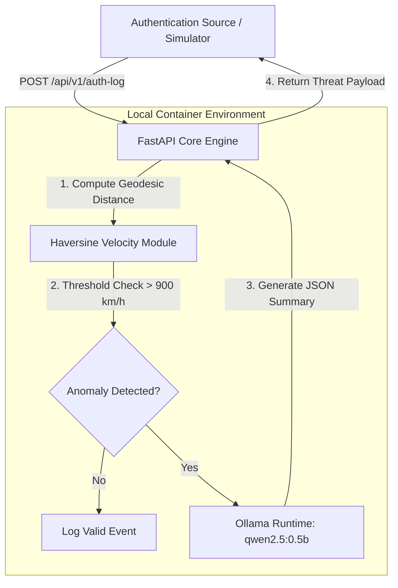

# GeoAegis-ID

A lightweight, local Identity Threat Detection and Response (ITDR) engine designed to identify anomalous authentication events using spatial-velocity calculations and local Small Language Model (SLM) threat triaging.

---

## Overview

GeoAegis-ID addresses impossible-travel authentication anomalies by monitoring login events across geographical locations. It calculates the minimum required flight speed between consecutive authentication attempts for a given user account. 

If the calculated velocity exceeds physically plausible thresholds (e.g., 900 km/h), the system flags the attempt as an anomaly and routes the context payload to a locally hosted SLM (`qwen2.5:0.5b` via Ollama) to generate deterministic, low-latency incident reports.

---

## Key Features

- **Impossible Travel Analytics:** Uses the Haversine formula to compute geodesic distance and required velocity between sequential logins.
- **Resource-Optimized SLM Triage:** Leverages `qwen2.5:0.5b` to summarize incident context under 400 MB RAM utilization and sub-200ms latency on CPU.
- **Containerized Architecture:** Fully orchestrates backend APIs and local model runtime using Docker Compose.
- **Zero-Cloud Dependency:** Designed for air-gapped or on-premises execution without reliance on third-party SaaS APIs.

---

## System Architecture



---

## Technology Stack

* **Language:** Python 3.11
* **API Framework:** FastAPI / Uvicorn
* **Inference Runtime:** Ollama (`qwen2.5:0.5b`)
* **Containerization:** Docker & Docker Compose
* **Math Utilities:** Geodesic Distance Computation

---

## Repository Structure

```text
GeoAegis-ID/
├── backend/
│   ├── app/
│   │   ├── main.py
│   │   ├── engine.py
│   │   └── utils.py
│   ├── Dockerfile
│   └── requirements.txt
├── docker-compose.yml
├── simulate_attack.py
└── README.md

```

---

## Prerequisites

* **Docker Desktop** (Engine 20.10+ with Docker Compose v2)
* **Git**

---

## Getting Started

### 1. Clone the Repository

```bash
git clone [https://github.com/your-username/GeoAegis-ID.git](https://github.com/your-username/GeoAegis-ID.git)
cd GeoAegis-ID

```

### 2. Build and Start Services

Launch the containerized backend and Ollama services:

```bash
docker compose up --build -d

```

### 3. Pull the Local SLM Model

Execute the model pull command inside the running Ollama container:

```bash
docker exec -it geoaegis_ollama ollama pull qwen2.5:0.5b

```

---

## Verification & Testing

Run the included attack simulation script to trigger sequential login events and verify impossible-travel detections:

```bash
python simulate_attack.py

```

### Sample Payload

```json
{
  "user_id": "usr_9921",
  "source_ip": "185.220.101.5",
  "location": {
    "latitude": 48.8566,
    "longitude": 2.3522,
    "city": "Paris",
    "country": "FR"
  },
  "timestamp": "2026-09-15T21:00:00Z"
}

```

### Expected Response Format

```json
{
  "status": "ANOMALY_DETECTED",
  "user_id": "usr_9921",
  "velocity_kmh": 4820.5,
  "threat_score": 95,
  "triage_summary": "Account usr_9921 authenticated from Paris, FR 12 minutes after a login from Gandhinagar, IN. Required travel velocity of 4820.5 km/h indicates credential compromise or proxy usage."
}

```

---

## Performance Considerations

| Metric | Measured Value |
| --- | --- |
| Model Footprint | ~350 MB RAM |
| Triage Latency (CPU) | < 200 ms |
| Velocity Precision | Floating-point geodesic calculation |

---

## License

Distributed under the MIT License. See `LICENSE` for details.
